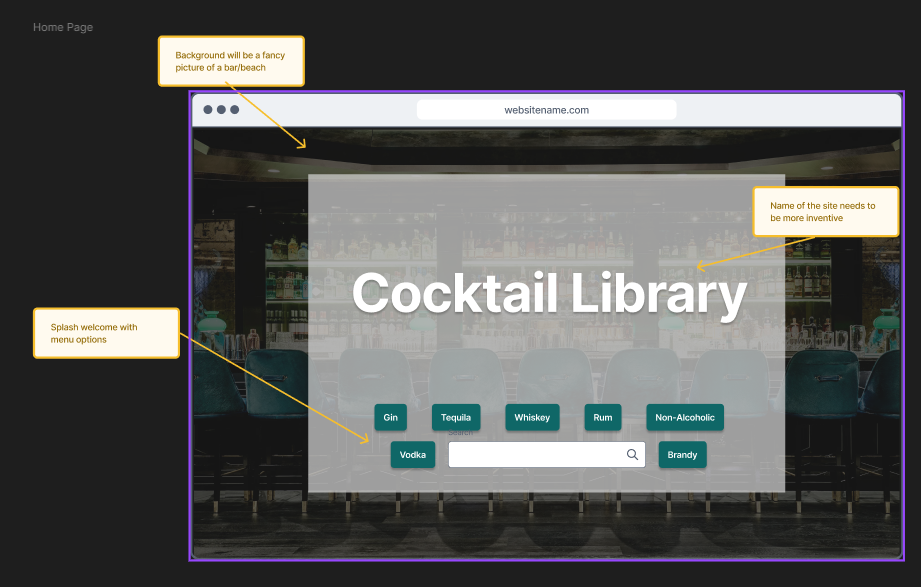
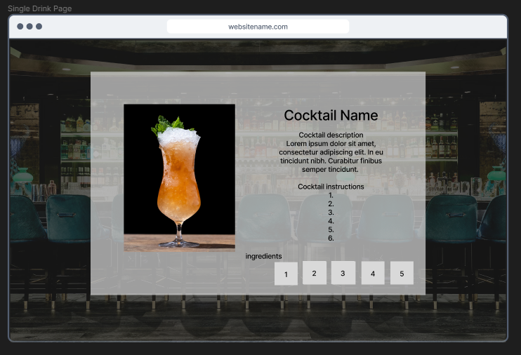
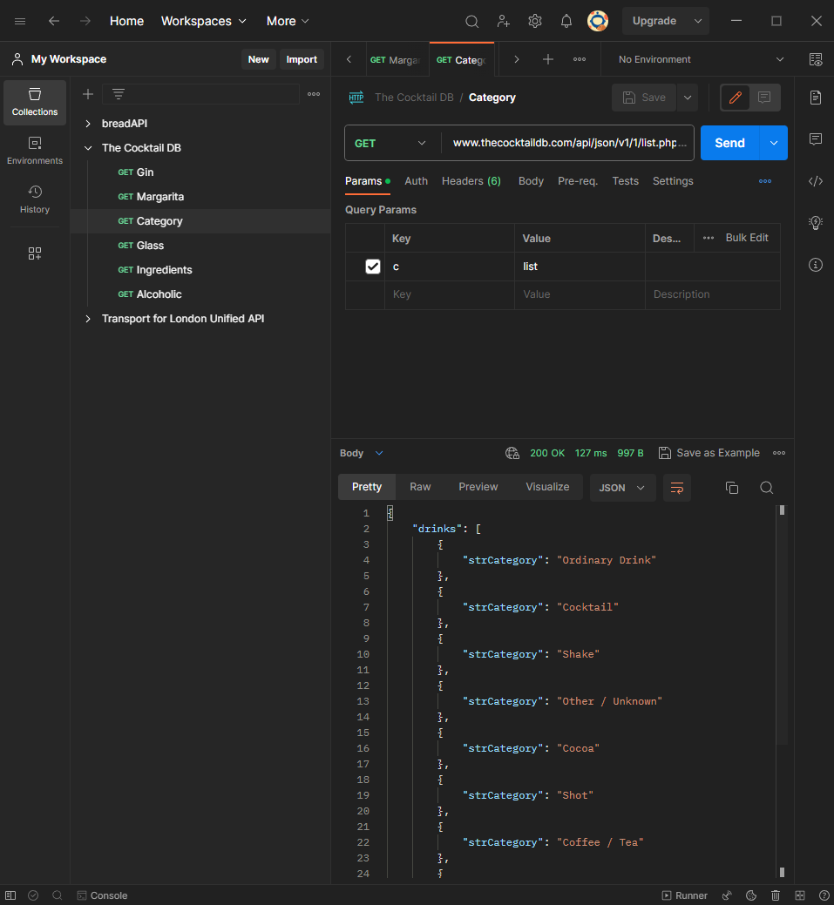
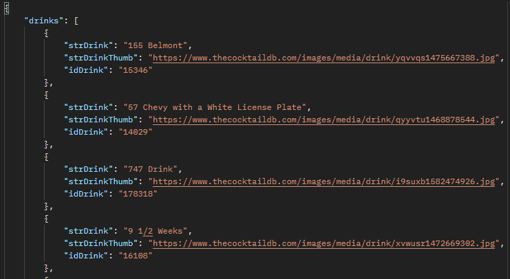
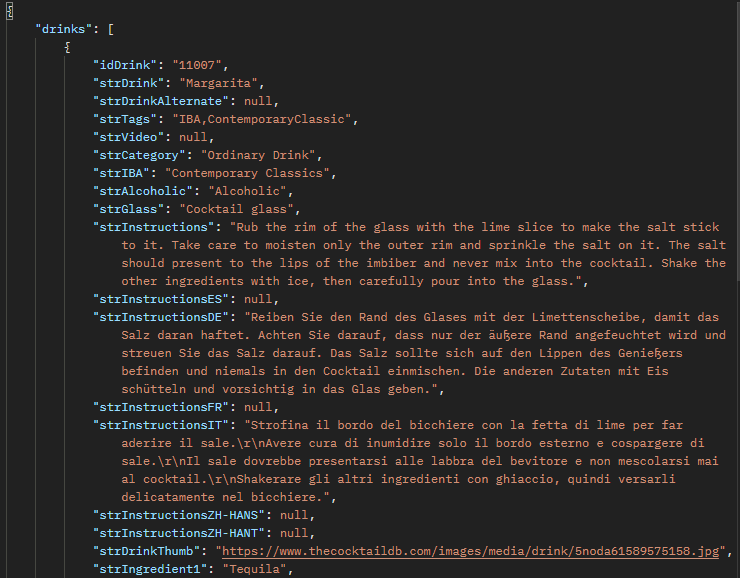
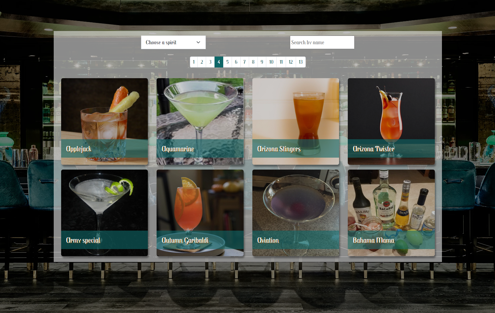
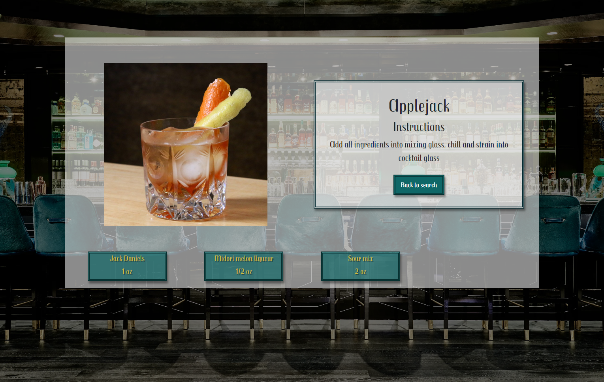

# Everyday Alchemy

## Description

Everyday Alchemy is a cocktail recipe database allowing users to search for their favourite cocktails and filter by spirit to find new ones.

## Link to the game

[Live link to project](https://everyday-alchemy.netlify.app/)

## Timeframe

I was given two days to complete a react-based app using javascript, HTML and CSS. My project is built using react and styled using bootstrap and SASS.

## Brief

* **Consume a public API** – this could be anything but it must make sense for your project.
* **Have several components**
* **The app can have a router** - with several "pages", this is up to you and if it makes sense for your project.
* **Include wireframes** - that you designed before building the app.
* **Be deployed online** and accessible to the public (hosted on your public github, not GA github!)

## Technologies used

HTML, CSS, JavaScript, SASS, React, Bootstrap

## Approach taken

## Planning

To begin I sketched out my plan using Figma to design my lay-out. I took inspiration from 1920's art deco asthetics to decide on colours and styles. I knew I wanted to have the main page display as many drinks as possible and to have individual pages that would display the recipes. I planned in pagination to simplify my drinks list as I wanted the page to not include scrolling.

### Home Page

### Search page

### Single page

## API testing

I found an external API that would return cocktail recipes including an image and a description of how to make it. The structure of the API was awkward and resulted in significant destructuring of the returned data including creating a new array for the ingredients. Due to time restraints I decided to only take the first 4 ingredients and come back to this to extend it if I had more time later in the project.

## App walkthrough

### Home page

### Search page

### Single page

## Challenges

* Some images from the API are pretty bad

This is an external API issue, to solve this I would have to create my own API
Some instructions/ingredients are not rendered fully
Use a scroll or dropdown option to allow displaying a full list of ingredients and instructions.
	
* API is restricted to maximum 100 items but querying for *all* cocktails is over 100. 

To solve this in the future I would paginate the requests or responses to ensure that I am able to view and search all of the cocktails instead of loading in all the cocktails on page load.

## Wins

- Strong theming for the pages, visuals using teal/gold to try and portray an idea of extravagence.
- The data in the API is structured in an awkward way to retrieve, with multiple names and objects to dig down to useful parts. In order to display these in a nice way I destructed and created my own data structure after the API call.

## Key Lessons

- My original plan had the collection displaying every cocktail from the database at once. In order to simplify this I implemented pagination to reduce the visual clutter and streamline the way recipes are viewed.

## Future improvements

- Add debouncing from the search input to smooth out the search options being made.

- Resize the app on mobile to prevent the whole background being loaded when only one entry is loaded.

- Add placeholder images so that the height does not change rapidly

- Collapse pagination on small mobiles to prevent resizing of the window