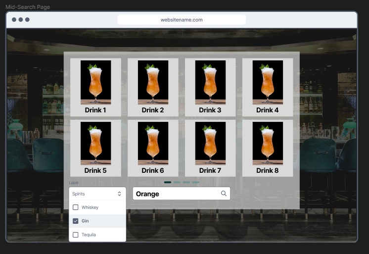

# Everyday Alchemy

Everyday Alchemy is a cocktail recipe database allowing users to search for their favourite cocktails and filter by spirit to find new ones.

## Link to the game

[Live link to project](https://everyday-alchemy.netlify.app/)

## Overview and Concept

I was given two days to complete a react-based app using javascript, HTML and CSS. My project is built using react and styled using bootstrap and SASS.

### React

I used react to create the framework for the app including react-router-dom to direct the user between the different pages

### Bootstrap

I used pagination, buttons, links etc to style the different parts of the app.

### SASS

I used SASS files to organise my CSS styling including the use of variables and mixins.

## Approach taken

## Planning

### Home Page

### Search page

### Single page

## API testing

## App walkthrough

### Home page

### Search page

### Single page

## Key Lessons

- Strong theming for the pages
- Destructuring the data from the api and creating an array to display the ingredients.

## Challenges

- Some images from the API are pretty bad quality
- Some instructions/ingredients are not rendered fully by the api
- API is restricted to maximum 100 items but querying for *all* cocktails is over 100. (prefiltered)

## Future improvements

- Add debouncing from the search input to smooth out the search options being made.

- Resize the app on mobile to prevent the whole background being loaded when only one entry is loaded.

- Add placeholder images so that the height does not change rapidly

- Collapse pagination on small mobiles to prevent resizing of the window

